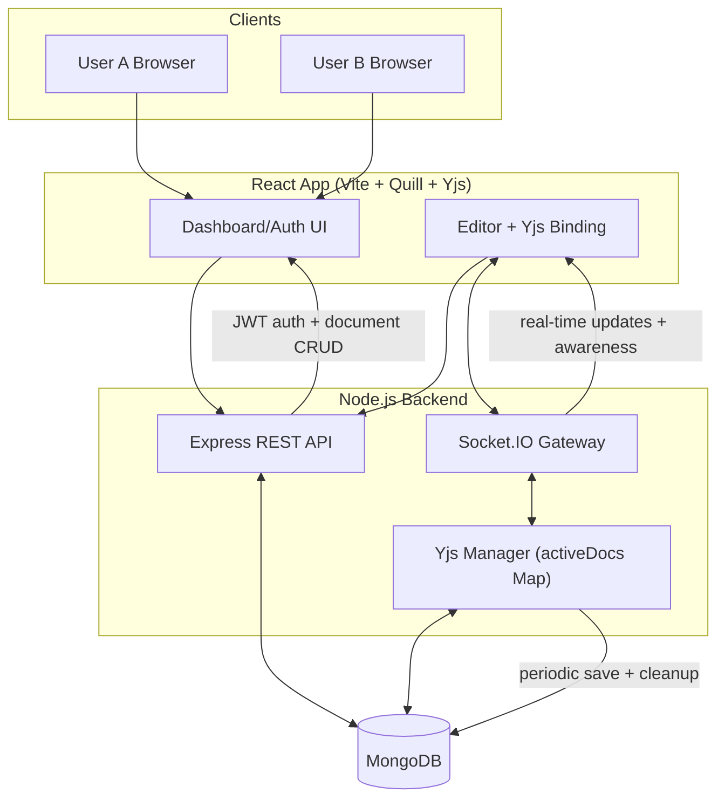
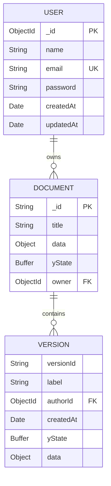

# MeDocs

MeDocs is a real-time collaborative document editor inspired by Google Docs.
It uses a React + Quill frontend, an Express + Socket.IO backend, Yjs for CRDT-based collaboration, and MongoDB for persistence.

## Features

- Real-time multi-user collaborative editing
- Presence cursors (who is editing where)
- JWT authentication with refresh-token cookie flow
- Document dashboard with create, rename, delete, and snippets
- Autosave for collaborative state and Quill delta
- Version snapshots (save, preview, restore)
- Export document as `.txt` or `.json`
- Rich text editing via Quill toolbar
- Light/Dark theme toggle

## Tech Stack

- Frontend: React 18, Vite, React Router, Quill, Yjs, y-quill, socket.io-client
- Backend: Node.js, Express 5, Socket.IO, Mongoose, JWT, bcrypt
- Database: MongoDB
- Realtime/CRDT: Yjs + awareness protocol

## Repository Structure

```txt
MeDocs/
├─ client/                         # React + Vite app
│  ├─ src/
│  │  ├─ components/               # Editor, Navbar, Dropdown, Modal, etc.
│  │  ├─ components/modals/        # Find/Replace, WordCount, VersionHistory...
│  │  ├─ context/AuthContext.jsx   # Auth state + refresh flow
│  │  ├─ hooks/                    # socket, yjs sync, docs API hooks
│  │  └─ pages/                    # Login, Register, Dashboard
│  └─ vite.config.js               # Bundle chunk strategy
├─ server/
│  ├─ controller/                  # Auth + document business logic
│  ├─ database/db.js               # Mongo connection
│  ├─ middleware/auth.js           # REST + socket JWT auth
│  ├─ routes/                      # /api/auth and /api/documents
│  ├─ schema/                      # User + Document mongoose schemas
│  ├─ services/yjsManager.js       # In-memory Y.Doc lifecycle and persistence
│  ├─ socket/handler.js            # Socket event orchestration
│  ├─ app.js                       # Express app config
│  └─ index.js                     # HTTP server + socket + periodic save
└─ README.md
```

## System Design

### High-Level Design (HLD) Diagram



### Core Components

- Client app (`client/src`)
- Auth pages + dashboard + editor UI
- Hooks for docs fetching, socket connection, and Yjs synchronization
- Backend API (`server/app.js`, routes/controllers)
- Auth and document endpoints
- WebSocket collaboration layer (`server/socket/handler.js`)
- Authenticated socket sessions
- Document room join/load/update/awareness/restore events
- Yjs manager (`server/services/yjsManager.js`)
- Holds active `Y.Doc` instances in memory (`activeDocs` map)
- Marks docs dirty on update, periodically persists to MongoDB
- Cleans up inactive docs after grace period

### Data Model



#### `user`

- `name: String`
- `email: String (unique)`
- `password: String (bcrypt hash)`
- `createdAt`, `updatedAt`

#### `document`

- `_id: String` (UUID from client)
- `title: String`
- `data: Object` (Quill delta)
- `yState: Buffer` (serialized Yjs state)
- `owner: ObjectId(user)`
- `versions[]` with:
- `versionId`, `label`, `authorId`, `createdAt`, `yState`, `data`

### Collaboration Flow


1. Client authenticates and connects Socket.IO with JWT access token.
2. Client emits `get-document` with `documentId`.
3. Server gets/creates Mongo document and in-memory Y.Doc.
4. Server hydrates Y.Doc from `yState` (or migrates legacy `data` delta), then emits `load-document`.
5. Local edits produce Yjs updates; client emits `yjs-update`.
6. Server applies update to in-memory Y.Doc and broadcasts to room.
7. Server marks doc dirty and periodically persists (`yState` + `data`) to MongoDB.
8. Awareness updates are broadcast for cursors/presence.

### Version Snapshot Flow

1. User saves snapshot from File menu.
2. Client sends current Yjs state + delta to `POST /api/documents/:id/versions`.
3. Server appends snapshot and retains last 50 versions.
4. On restore, backend updates DB to selected snapshot.
5. Socket event `restore-version` replaces in-memory Y.Doc and triggers all clients to reload.

### Auth Design

- Access token: JWT, 30 minutes, sent as `Authorization: Bearer <token>`
- Refresh token: JWT, 7 days, stored in HTTP-only cookie (`refreshToken`)
- Session restore: client calls `/api/auth/refresh` on app boot
- Auto refresh: client refreshes access token every 25 minutes

## API Reference

Base URL: `http://localhost:9000`

### Health

- `GET /health`

### Auth

- `POST /api/auth/register`
- `POST /api/auth/login`
- `POST /api/auth/refresh` (uses cookie)
- `POST /api/auth/logout`

### Documents (Bearer token required)

- `GET /api/documents`
- `PATCH /api/documents/:id/title`
- `DELETE /api/documents/:id`
- `GET /api/documents/:id/export?format=txt|json`

### Versioning

- `POST /api/documents/:id/versions`
- `GET /api/documents/:id/versions`
- `GET /api/documents/:id/versions/:vid`
- `POST /api/documents/:id/versions/:vid/restore`

## Socket Events

### Client -> Server

- `get-document(documentId)`
- `yjs-update(updateBytes)`
- `awareness-init(clientId)`
- `awareness-update(updateBytes)`
- `save-title(title)`
- `restore-version({ versionId })`

### Server -> Client

- `load-document({ yState, title, owner })`
- `yjs-update(updateBytes)`
- `awareness-update(updateBytes)`
- `awareness-remove(clientId)`
- `title-updated(title)`
- `restore-document`

## Local Setup

### Prerequisites

- Node.js 18+
- MongoDB running locally or remote connection string

### 1) Clone and install

```bash
git clone <your-repo-url>
cd MeDocs
cd server && npm install
cd ../client && npm install
```

### 2) Configure backend env

Create `server/.env`:

```env
PORT=9000
MONGO_URI=mongodb://127.0.0.1:27017/meDocs
JWT_ACCESS_SECRET=your_access_secret
JWT_REFRESH_SECRET=your_refresh_secret
FRONTEND_URL=http://localhost:5173
NODE_ENV=development
```

### 3) Configure frontend env

Create `client/.env`:

```env
VITE_API_URL=http://localhost:9000
```

### 4) Run locally

Backend:

```bash
cd server
node index.js
```

Frontend:

```bash
cd client
npm run dev
```

Open `http://localhost:5173`.

## Deployment Notes

- Client includes `vercel.json` rewrite for SPA routing.
- Configure CORS via backend `FRONTEND_URL`.
- In production, set `NODE_ENV=production` so refresh cookie is `secure` and `sameSite=none`.
- Ensure HTTPS in production for secure cookie behavior.

## Current Limitations / Trade-offs

- No automated tests currently.
- In-memory `activeDocs` means horizontal scaling needs shared pub/sub or Yjs provider strategy.
- Snapshot restore currently triggers full page reload on clients.
- No role-based collaboration permissions yet (single owner model for delete).
- No explicit rate limiting / brute-force protection on auth routes.

## Suggested Next Improvements

1. Add test coverage (API integration + CRDT sync behavior).
2. Add Redis adapter for Socket.IO + shared doc state for multi-instance scaling.
3. Add invitation-based sharing and per-document access control.
4. Add observability: structured logs, metrics, and error tracing.
5. Add CI pipeline with lint/test/build gates.


