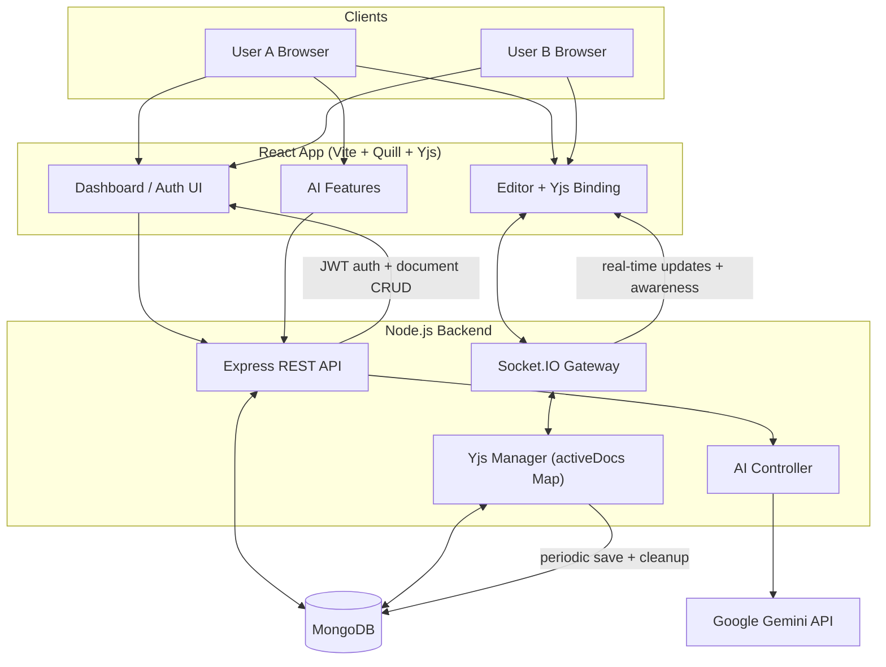
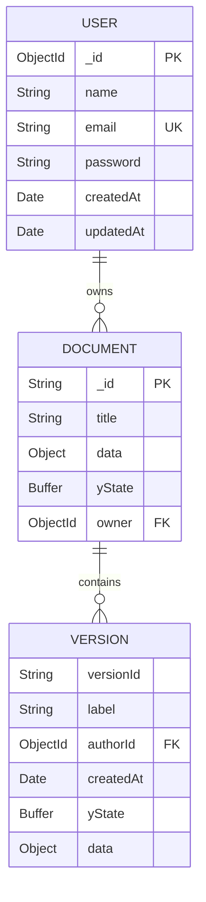
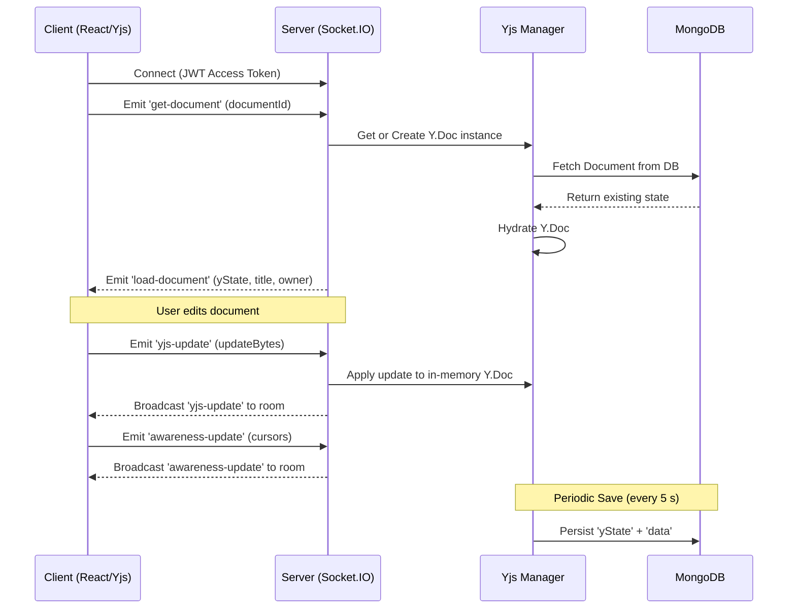

# MeDocs

MeDocs is a real-time collaborative document editor inspired by Google Docs.
It uses a React + Quill frontend, an Express + Socket.IO backend, Yjs for CRDT-based collaboration, and MongoDB for persistence.

## Features

- Real-time multi-user collaborative editing (CRDT via Yjs)
- Presence cursors with per-user colour highlights
- JWT authentication with refresh-token cookie flow
- Document dashboard with create, rename, delete, and snippet preview
- Autosave — collaborative Yjs state and Quill delta persisted every 5 s
- **Version snapshots** — save, preview, and restore; in-place re-hydration (no page reload)
- Export document as `.txt` or `.json`
- Rich text editing via Quill Snow toolbar
- **AI "Help Me Write"** — prompt-based paragraph/content generation (Gemini 2.5 Flash)
- **Smart autocomplete** — ghost-text inline suggestions (5–6 words, Tab to accept)
- Light / Dark theme toggle

## Tech Stack

| Layer | Technologies |
|---|---|
| Frontend | React 18, Vite, React Router, Quill, Yjs, y-quill, socket.io-client |
| Backend | Node.js, Express 5, Socket.IO, Mongoose, JWT, bcrypt |
| AI | Google Gemini 2.5 Flash (`@google/genai`) |
| Database | MongoDB |
| Realtime / CRDT | Yjs + y-protocols/awareness |

## Repository Structure

```txt
MeDocs/
├─ client/                         # React + Vite app
│  ├─ src/
│  │  ├─ components/               # Editor, Navbar, Dropdown, Modal, etc.
│  │  ├─ components/modals/        # Find/Replace, WordCount, VersionHistory…
│  │  ├─ context/AuthContext.jsx   # Auth state + refresh flow
│  │  ├─ hooks/                    # useSocket, useYjsSync, useSmartAutocomplete…
│  │  └─ pages/                    # Login, Register, Dashboard
│  └─ vite.config.js
├─ server/
│  ├─ controller/                  # Auth + document + AI business logic
│  ├─ database/db.js               # Mongo connection
│  ├─ middleware/auth.js           # REST + socket JWT auth
│  ├─ routes/                      # /api/auth, /api/documents, /api/ai
│  ├─ schema/                      # User + Document mongoose schemas
│  ├─ services/yjsManager.js       # In-memory Y.Doc lifecycle and persistence
│  ├─ socket/handler.js            # Socket event orchestration
│  ├─ app.js                       # Express app config
│  └─ index.js                     # HTTP server + socket + periodic save
└─ README.md
```

## System Design

### High-Level Architecture



### Core Components

- **Client app** (`client/src`) — Auth pages, dashboard, editor UI, AI prompt modal, smart autocomplete ghost text
- **Yjs sync hook** (`hooks/useYjsSync.js`) — manages a live `Y.Doc`, `QuillBinding`, `UndoManager`, and `Awareness`; handles in-place snapshot re-hydration
- **Socket handler** (`server/socket/handler.js`) — authenticated socket sessions, document room join/load/update/awareness/restore events
- **Yjs manager** (`server/services/yjsManager.js`) — holds active `Y.Doc` instances in memory, marks docs dirty on update, periodically persists to MongoDB, cleans up after grace period; `replaceYDocState` performs a clean CRDT-safe swap for snapshot restores
- **AI controller** (`server/controller/ai-controller.js`) — wraps Gemini 2.5 Flash for both full-text generation and short autocomplete suggestions; shared rate-limit state with retry-after headers

### Data Model



### Collaboration Flow



1. Client authenticates and connects Socket.IO with JWT access token.
2. Client emits `get-document` with `documentId`.
3. Server gets/creates Mongo document and in-memory Y.Doc.
4. Server hydrates Y.Doc from `yState` (or migrates legacy `data` delta), then emits `load-document`.
5. Local edits produce Yjs updates; client emits `yjs-update`.
6. Server applies update to in-memory Y.Doc and broadcasts to room.
7. Server marks doc dirty and periodically persists (`yState` + `data`) to MongoDB.
8. Awareness updates are broadcast for cursors/presence.

### Version Snapshot Flow

1. User saves a snapshot from **File → Save snapshot**.
2. Client encodes the live Y.Doc state and sends it to `POST /api/documents/:id/versions`.
3. Server appends the snapshot (up to 50 retained per document).
4. On restore, server updates MongoDB to the selected snapshot's `yState`.
5. Socket handler calls `replaceYDocState` — creates a fresh `Y.Doc` from the snapshot state server-side, then broadcasts `restore-document` with the encoded snapshot state to all clients in the room.
6. Each client tears down its current `Y.Doc`, `QuillBinding`, and `UndoManager`; builds a fresh `Y.Doc` from the received state; and re-attaches everything — **no page reload required**.

### AI Features

- **Help Me Write** (✨ FAB button) — user enters a free-text prompt; Gemini generates prose that is inserted at the current cursor position.
- **Smart Autocomplete** — as the user types, the cursor context is debounced and sent to `POST /api/ai/autocomplete`; a 5–6 word ghost-text suggestion appears inline. Press **Tab** to accept.
- Both features share a server-side rate-limit state. When the Gemini quota is exhausted the FAB turns red and shows a countdown; autocomplete is suppressed until the cooldown expires.

### Auth Design

- Access token: JWT, 30 minutes, sent as `Authorization: Bearer <token>`
- Refresh token: JWT, 7 days, stored in HTTP-only cookie (`refreshToken`)
- Session restore: client calls `/api/auth/refresh` on app boot
- Auto refresh: client refreshes access token every 25 minutes

## API Reference

Base URL: `http://localhost:9000`

### Health

- `GET /health`

### Auth

- `POST /api/auth/register`
- `POST /api/auth/login`
- `POST /api/auth/refresh` (uses cookie)
- `POST /api/auth/logout`

### Documents (Bearer token required)

- `GET  /api/documents`
- `PATCH  /api/documents/:id/title`
- `DELETE  /api/documents/:id`
- `GET  /api/documents/:id/export?format=txt|json`

### Versioning (Bearer token required)

- `POST /api/documents/:id/versions`
- `GET  /api/documents/:id/versions`
- `GET  /api/documents/:id/versions/:vid`
- `POST /api/documents/:id/versions/:vid/restore`

### AI (Bearer token required)

- `POST /api/ai/generate` — body: `{ prompt: string }`
- `POST /api/ai/autocomplete` — body: `{ prefix: string }`

## Socket Events

### Client → Server

| Event | Payload |
|---|---|
| `get-document` | `documentId` |
| `yjs-update` | `updateBytes` (Uint8Array) |
| `awareness-init` | `clientId` |
| `awareness-update` | `updateBytes` |
| `save-title` | `title` |
| `restore-version` | `{ versionId }` |

### Server → Client

| Event | Payload |
|---|---|
| `load-document` | `{ yState, title, owner }` |
| `yjs-update` | `updateBytes` |
| `awareness-update` | `updateBytes` |
| `awareness-remove` | `clientId` |
| `title-updated` | `title` |
| `restore-document` | `{ yState }` — snapshot state for in-place re-hydration |

## Local Setup

### Prerequisites

- Node.js 18+
- MongoDB running locally or a remote connection string
- A Google Gemini API key (for AI features)

### 1. Clone and install

```bash
git clone <your-repo-url>
cd MeDocs
cd server && npm install
cd ../client && npm install
```

### 2. Configure backend env

Create `server/.env`:

```env
PORT=9000
MONGO_URI=mongodb://127.0.0.1:27017/meDocs
JWT_ACCESS_SECRET=your_access_secret
JWT_REFRESH_SECRET=your_refresh_secret
FRONTEND_URL=http://localhost:5173
NODE_ENV=development
GEMINI_API_KEY=your_gemini_api_key
# Optional: override AI rate-limit cooldown in ms (default 60 000)
AI_RATE_LIMIT_COOLDOWN_MS=60000
```

### 3. Configure frontend env

Create `client/.env`:

```env
VITE_API_URL=http://localhost:9000
```

### 4. Run locally

```bash
# Terminal 1 — backend
cd server && npm start

# Terminal 2 — frontend
cd client && npm run dev
```

Open `http://localhost:5173`.

## Deployment Notes

- Client includes `vercel.json` rewrite for SPA routing.
- Configure CORS origin via `FRONTEND_URL` on the backend.
- In production, set `NODE_ENV=production` so the refresh cookie is `Secure` and `SameSite=None`.
- Ensure HTTPS in production for secure cookie behaviour.

## Current Limitations / Trade-offs

- No automated tests.
- In-memory `activeDocs` means horizontal scaling requires a shared pub/sub layer or an external Yjs provider (e.g. Hocuspocus + Redis).
- Single-owner access model — no per-document role-based permissions yet.
- No explicit rate limiting / brute-force protection on auth routes.
- AI quota is tracked in process memory; a server restart resets the cooldown state.

## Suggested Next Improvements

1. Add test coverage (API integration + CRDT sync behaviour).
2. Add Redis adapter for Socket.IO + shared Y.Doc state for multi-instance scaling.
3. Add invitation-based sharing and per-document access control.
4. Add observability: structured logs, metrics, and error tracing.
5. Add CI pipeline with lint / test / build gates.
6. Persist AI rate-limit state (e.g. Redis) so restarts don't reset the quota window.
